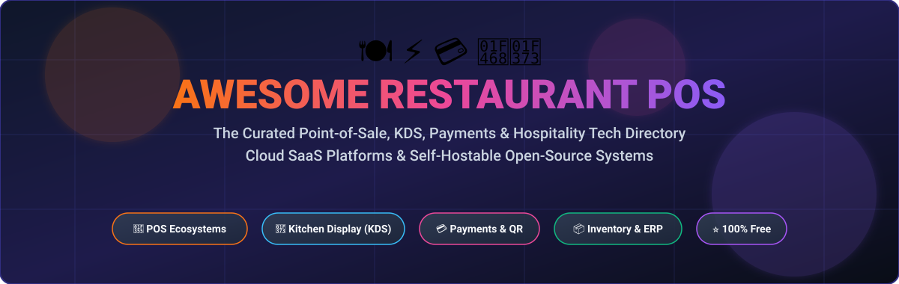
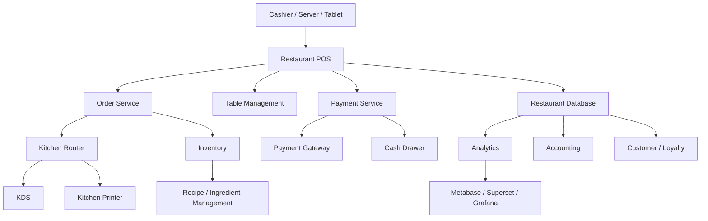
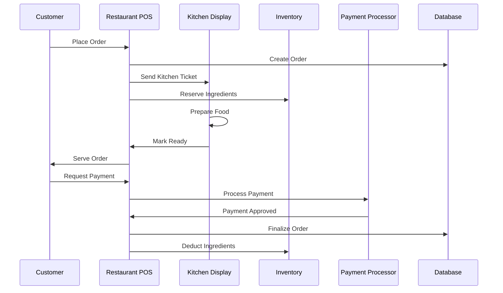
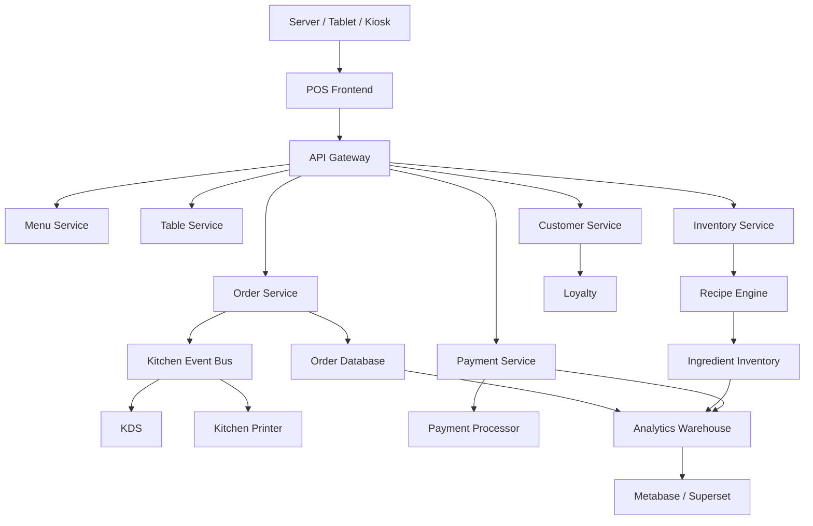
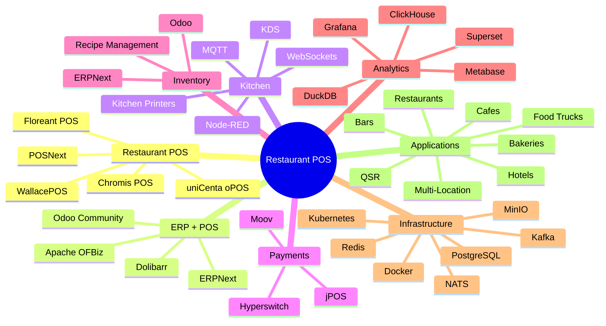

# Awesome-Restaurant-POS 🍽️⚡💳

<div align="center">

<a href="https://github.com/ishandutta2007/Awesome-Awesome-Awesome"></a><a href="https://discord.gg/jc4xtF58Ve"></a>


<a href="https://github.com/ishandutta2007"></a>

<br/><br/>

<a href="https://github.com/ishandutta2007/Awesome-Restaurant-POS">
  
</a>

<br/>

### 🍕 Curated Point-of-Sale (POS) Systems, Kitchen Display Systems (KDS), Hospitality ERP & Restaurant Tech 🚀
*A comprehensive, developer-first guide to commercial SaaS platforms and open-source self-hostable restaurant management solutions.*

**Last updated: September 2026** 🗓️

</div>

---

## 🌟 Overview & Industry Ecosystem

This curated awesome repository tracks modern **Cloud SaaS & Hosted restaurant POS platforms** alongside battle-tested **Open-Source POS projects, Kitchen Display Systems (KDS), tableside ordering apps, payment orchestration gateways, and restaurant inventory ERPs**. Whether you run fine dining restaurants, quick-service food chains (QSRs), cafés, craft breweries, food trucks, cloud dark kitchens, or multi-location franchise hospitality groups, this directory catalogs the premier software architectures and technology building blocks available today.

**Notable commercial platforms** include Toast, Square for Restaurants, TouchBistro, Lightspeed Restaurant, Clover, Oracle MICROS, Revel Systems, SpotOn Restaurant, CAKE POS, and Epos Now.

Modern restaurant technology unites a comprehensive software and hardware ecosystem:

* 🍽️ **Point-of-Sale (POS) & Order Taking:** Handheld terminals, QR code self-ordering, kiosk interfaces, and multi-station registers.
* 🪑 **Table & Floor Management:** Real-time floor plans, seat-level assignment, course management, and guest reservations.
* 💳 **Payment Processing & Terminals:** EMV chip, contactless NFC, tap-to-pay, split bills, and tip distribution.
* 👨‍🍳 **Kitchen Display Systems (KDS):** Digital line cook displays, expo routing screens, and ticket preparation routing.
* 📦 **Recipe & Inventory Management:** Food-cost forecasting, automated ingredient depletion, supplier purchase orders, and stock alerts.
* 🧾 **Fiscalization & Compliance:** Automated local sales taxes, digital receipts, fiscal cash registers, and PCI DSS standards.
* 👥 **Staff & Labor Scheduling:** Time clocks, employee tip pools, shift tracking, role permissions, and payroll workflows.
* 📱 **Online Ordering & Omnichannel Delivery:** First-party digital storefronts and aggregator integrations (DoorDash, Uber Eats, Deliveroo).
* 🎁 **Customer Loyalty & CRM:** Automated diner rewards, gift card programs, and marketing automation.
* 📊 **Restaurant Business Analytics:** Real-time revenue dashboards, labor percentage benchmarks, food waste reporting, and BI pipelines.
* 🧮 **Hospitality Accounting & ERP:** Daily reconciliation, ledger entries, purchasing, and franchise accounts.
* 🏪 **Multi-Location & Franchise Management:** Centralized menu distribution, multi-unit governance, and consolidated reporting.

> 💡 **Open-Source Focus:** This repository places a high emphasis on **self-hostable restaurant POS software, modular components, and reusable open-source foundations**, including Floreant POS, Chromis POS, uniCenta oPOS, WallacePOS, POSNext, ERPNext, Odoo Community, Open Source Point of Sale, and related hospitality software stacks.

> ⚠️ **Compliance Note:** An open-source POS can power order taking, table arrangements, inventory, and kitchen dispatch; however, real-world card processing, certified payment terminals, PCI DSS conformance, fiscal memory modules, and merchant acquiring relationships require external services and verified hardware.

---

## 📑 Table of Contents

* [☁️ SaaS/Hosted Platforms](#️-saashosted-platforms)
* [💻 Open-Source](#open-source)
* [🍽️ Open-Source Restaurant POS](#️-open-source-restaurant-pos)
* [🛒 Open-Source General POS](#-open-source-general-pos)
* [🏢 Open-Source ERP + POS](#-open-source-erp--pos)
* [👨‍🍳 Open-Source Kitchen Display Systems](#open-source-kitchen-display-systems)
* [📋 Open-Source Restaurant Management](#open-source-restaurant-management)
* [📦 Open-Source Inventory & Recipe Management](#open-source-inventory--recipe-management)
* [💳 Open-Source Payments](#-open-source-payments)
* [📊 Open-Source Restaurant Analytics](#-open-source-restaurant-analytics)
* [🧱 Open-Source Building Blocks](#open-source-building-blocks)
* [🔄 Commercial Platform → Open-Source Equivalent](#commercial-platform--open-source-equivalent)
* [🏗️ Restaurant POS Architecture](#restaurant-pos-architecture)
* [📐 Open-Source Restaurant POS Architecture](#open-source-restaurant-pos-architecture)
* [🔄 Restaurant Order → Kitchen → Payment Flow](#restaurant-order--kitchen--payment-flow)
* [⚖️ Commercial vs Open-Source](#commercial-vs-open-source)
* [🚀 Recommended Open-Source Stacks](#recommended-open-source-stacks)
* [📊 Restaurant POS Technology Comparison](#restaurant-pos-technology-comparison)
* [🎯 Recommended Projects by Use Case](#recommended-projects-by-use-case)
* [🛠️ Building a Toast Alternative](#building-a-toast-alternative)
* [🛠️ Building an Open-Source Restaurant POS](#building-an-open-source-restaurant-pos)
* [🗺️ Open-Source Restaurant POS Landscape](#open-source-restaurant-pos-landscape)
* [💡 Why Open-Source Restaurant POS Matters](#why-open-source-restaurant-pos-matters)
* [⭐ Top Open-Source Restaurant POS & Hospitality Projects](#-top-open-source-restaurant-pos--hospitality-projects)
* [📈 Star History](#-star-history)
* [🤝 How to Contribute](#how-to-contribute)
* [📜 Disclaimer](#disclaimer)

---

# ☁️ SaaS/Hosted Platforms

> 📊 **Market Size & Industry Dynamics:** The global restaurant POS software and terminal market is estimated at **~$26.5 Billion in 2026** (projected to reach over **$42 Billion by 2030** at an 8.5%–10.2% CAGR). The sector is **moderately to highly fragmented** across independent SMBs, regional food operations, and specialized niches (food trucks, coffee shops, fine dining, ghost kitchens), but displays strong **oligopolistic concentration at the high end** where leading enterprise giants and integrated fintech processors (such as Oracle MICROS, Block/Square, Toast, Fiserv/Clover, and NCR Voyix) capture the bulk of total processing volume and large chain accounts.

| Platform | Company | Company Size (Valuation / Market Cap / Revenue) | Primary Focus | Key Capabilities | Pricing | Free Tier / Free Trial Limits |
| --- | --- | --- | --- | --- | --- | --- |
| **[Oracle MICROS](https://www.oracle.com/food-beverage/restaurant-pos/)** | Oracle (NYSE: ORCL) | ~$410 Billion Market Cap (~$53B Annual Revenue) | Enterprise hospitality POS | Enterprise POS, tables, kitchen, payments, inventory, analytics | Starts at $55/mo per workstation (Simphony Essentials) | No free tier or trial; sales demo and custom enterprise quotes only |
| **[Clover](https://www.clover.com/)** | Fiserv (NYSE: FI) | ~$115 Billion Market Cap (~$19B Annual Revenue) | POS + payments | Restaurant POS, payments, apps, employee management | Starts at $14.95/mo (Starter software) or $130/mo (hardware bundle) | 90-day free software trial on select SaaS subscription plans (limited to 90 consecutive calendar days per tax ID); no permanent free tier |
| **[Square for Restaurants](https://squareup.com/us/en/restaurants)** | Block, Inc. (NYSE: XYZ) | ~$48 Billion Market Cap (~$22B Annual Revenue) | SMB restaurant POS | POS, payments, online ordering, KDS, loyalty, inventory | Starts at $0/mo (Free plan) / $60/mo per location (Plus) | Free forever plan ($0/mo) with unlimited transactions and 1 terminal; excludes customized floor plans, advanced course management, and native KDS; 30-day free trial for Plus plan |
| **[Heartland Restaurant](https://www.heartland.us/restaurant)** | Global Payments (NYSE: GPN) | ~$27 Billion Market Cap (~$10B Annual Revenue) | Restaurant POS | POS, payments, employee management, reporting | Starts at $89/mo for 1 station | No free POS software tier or trial; 60 to 90-day trial offered occasionally for specific add-ons only; demo available |
| **[Toast](https://pos.toasttab.com/)** | Toast, Inc. (NYSE: TOST) | ~$18 Billion Market Cap (~$4.8B Annual Revenue) | Restaurant POS ecosystem | POS, payments, KDS, online ordering, payroll, loyalty, inventory | Starts at $0/mo (Starter Kit) / $69/mo (Standard POS) | Free forever Starter plan ($0/mo) for 1–2 terminals at a single location; standard payment processing fees apply; no general free trial |
| **[NCR Voyix Aloha](https://www.ncrvoyix.com/restaurant/aloha)** | NCR Voyix (NYSE: VYX) | ~$2.1 Billion Market Cap (~$3.8B Annual Revenue) | Enterprise restaurant POS | POS, payments, KDS, labor, enterprise restaurant management | Starts at $175/mo per terminal (Aloha Essentials bundle) | No free tier or trial; sales consultation and live product demo only |
| **[Lightspeed Restaurant](https://www.lightspeedhq.com/pos/restaurant/)** | Lightspeed Commerce (NYSE: LSPD) | ~$2.0 Billion Market Cap (~$910M Annual Revenue) | Restaurant & hospitality POS | POS, inventory, tables, payments, analytics, multi-location | Starts at $69/mo (Starter plan, billed annually) | No free tier or trial for restaurant POS; guided live product demo only |
| **[SpotOn Restaurant](https://www.spoton.com/restaurants/)** | SpotOn Transact | ~$3.6 Billion Private Valuation (~$600M Annual Revenue) | Restaurant technology | POS, payments, online ordering, reservations, marketing | Starts at $0/mo (Quick Start / processing-bundled) or $55/mo per station (Essentials) | Free forever software on Quick Start plan ($0/mo) with SpotOn payment processing; no self-service free trial; live demo only |
| **[CAKE POS](https://www.trycake.com/)** | PAR Technology (NYSE: PAR) | ~$1.9 Billion Market Cap (~$420M Annual Revenue) | Restaurant POS | POS, payments, KDS, online ordering, loyalty | Starts at $0/mo (bundled into processing) or $69/mo | No free tier or trial; live 1-on-1 advisor demo only |
| **[PAR Brink POS](https://partech.com/restaurant/)** | PAR Technology (NYSE: PAR) | ~$1.9 Billion Market Cap (~$420M Annual Revenue) | Enterprise restaurant POS | QSR POS, drive-thru, payments, digital ordering | Starts at $90/mo per terminal | No free tier or trial; live product demo only |
| **[TouchBistro](https://www.touchbistro.com/)** | TouchBistro (Francisco Partners) | ~$1.5 Billion Valuation (~$120M Annual Revenue) | Restaurant POS | iPad POS, tables, reservations, payments, reporting | Starts at $69/mo (Solo POS) | No free tier or trial; guided live product demo only |
| **[Restaurant365 POS](https://www.restaurant365.com/)** | Restaurant365 (KKR / Bessemer) | ~$1.0 Billion Valuation (~$100M+ Annual ARR) | Restaurant operations | POS, accounting, inventory, labor, analytics | Starts at $499/mo per location (Essentials core tier) | No free tier or trial; personalized guided demo only |
| **[Revel Systems](https://revelsystems.com/)** | Shift4 (Acquired for $250M) / Shift4 $7B Cap | ~$250 Million Acquisition Value (~$85M Annual Revenue) | iPad restaurant POS | POS, inventory, employee management, analytics, multi-location | Starts at $99/mo per terminal (annual contract) | No free POS software plan or trial; optional Revel+ support service includes a 60-day (2-month) trial |
| **[Crunchtime](https://www.crunchtime.com/)** | Crunchtime (Battery Ventures) | ~$500 Million Valuation (~$80M Annual Revenue) | Enterprise restaurant operations | Operations, inventory, labor, food safety, analytics | Starts at $100/mo per location (module-dependent enterprise tier) | No free tier or trial; tailored enterprise demo only |
| **[HungerRush](https://www.hungerrush.com/)** | HungerRush (The CapStreet Group) | ~$250 Million Valuation (~$60M Annual Revenue) | Restaurant technology | POS, online ordering, delivery, marketing | Starts at $199/mo | No free tier or trial; live guided demo only |
| **[Epos Now](https://www.eposnow.com/)** | Epos Now | ~$400 Million Valuation (~$50M Annual Revenue) | Hospitality POS | POS, payments, inventory, reporting, integrations | Starts at $39/mo (standard software-only license) | 30-day free trial (full software access for up to 30 consecutive days); no permanent free plan |
| **[GoTab](https://gotab.io/)** | GoTab | ~$100 Million Valuation (~$25M Annual Revenue) | Restaurant commerce | POS, QR ordering, payments, tableside ordering | Starts at $15/mo (entry tier) + transaction processing fees | No free tier or trial; guided live demo and proposal only |
| **[Rezku](https://rezku.com/)** | Rezku / GuestPlus | ~$30 Million Valuation (~$10M Annual Revenue) | Restaurant POS | POS, KDS, online ordering, loyalty, reporting | Starts at $49/mo per terminal | 14-day free trial available upon request through demo/onboarding; no permanent free software tier |
| **[Lavu](https://lavu.com/)** | Lavu | ~$50 Million Valuation (~$15M Annual Revenue) | iPad restaurant POS | POS, payments, inventory, loyalty, online ordering | Starts at $59/mo (Starter plan, 1 terminal) | No free tier or trial; live walkthrough demo only |

Current restaurant-POS comparisons continue to place Toast, Square, Lightspeed, TouchBistro, Clover, SpotOn and enterprise platforms such as Oracle MICROS among the major restaurant POS systems.

---

# Open-Source

The open-source restaurant POS ecosystem is smaller than the commercial ecosystem, but there are several useful projects.

```text
                    OPEN-SOURCE RESTAURANT POS
                               │
          ┌────────────────────┼────────────────────┐
          │                    │                    │
          ▼                    ▼                    ▼
    Restaurant POS          General POS          ERP + POS
          │                    │                    │
          ▼                    ▼                    ▼
     Floreant POS         uniCenta oPOS         ERPNext
     Chromis POS           OSPOS                  Odoo
     WallacePOS            WallacePOS             Dolibarr
          │
          ▼
    Restaurant-specific
    tables + kitchen +
    orders + modifiers
```

---

# 🍽️ Open-Source Restaurant POS

*Curated standalone point-of-sale systems built specifically for restaurant, café, and hospitality workflows. Sorted by GitHub_Stars.*

---

## 🌟 [TastyIgniter](https://github.com/TastyIgniter/TastyIgniter) [](https://github.com/TastyIgniter/TastyIgniter/stargazers)

**[TastyIgniter](https://github.com/TastyIgniter/TastyIgniter)** [](https://github.com/TastyIgniter/TastyIgniter/stargazers) is an extensible open-source restaurant management, online ordering, and tableside ordering platform.

Key capabilities include:

* 📱 Online ordering & menu management
* 🪑 Table reservations & floor seating
* 💳 Multichannel payment gateways (Stripe, PayPal)
* 👨‍🍳 Kitchen order routing & dispatching
* 🛵 Delivery management & zones
* 🔌 Rich plugin and extension architecture
* 📱 Mobile-responsive staff and guest portals

TastyIgniter is built on modern PHP/Laravel frameworks and released under the **MIT** license.

---

## 🌟 [WallacePOS](https://github.com/micwallace/wallacepos) [](https://github.com/micwallace/wallacepos/stargazers)

**[WallacePOS](https://github.com/micwallace/wallacepos)** [](https://github.com/micwallace/wallacepos/stargazers) is a lightweight, responsive web-based open-source POS application designed with food-service ordering workflows.

Key features include:

* 🌐 Web-based POS terminal running on modern browsers
* 🍔 Restaurant, café, and bar quick-order modes
* 🧾 Kitchen and receipt thermal printing (ESC/POS)
* 📦 Product modifiers and item variants
* 👥 Multi-user cashier permissions
* 📊 Sales summaries and shift closeout reports

> ⚠️ The original repository is no longer actively maintained and serves as a clean reference codebase or starting point for modern custom web POS builds.

---

## 🌟 [uniCenta oPOS](https://github.com/uniCenta/uniCentaPOS) [](https://github.com/uniCenta/uniCentaPOS/stargazers)

**[uniCenta oPOS](https://github.com/uniCenta/uniCentaPOS)** [](https://github.com/uniCenta/uniCentaPOS/stargazers) is a premier cross-platform POS platform with deep restaurant, hospitality, and retail functionality.

Capabilities include:

* 🪑 Visual floor plan & table layout designer
* 👨‍🍳 Kitchen tickets & multiple printer routing
* 💳 Cash drawers, barcode scanners, customer-facing displays
* 📦 Inventory tracking and ingredient deductions
* 👥 Employee time clock and role security
* 📊 Comprehensive sales reporting and tax auditing
* 🖥️ Multi-terminal networked database synchronization (MySQL / PostgreSQL)

Licensed under **GPL v3**.

---

## 🌟 [Floreant POS](https://github.com/floreantpos/floreantpos) [](https://github.com/floreantpos/floreantpos/stargazers)

**[Floreant POS](https://github.com/floreantpos/floreantpos)** [](https://github.com/floreantpos/floreantpos/stargazers) is a legendary open-source restaurant POS deployed worldwide across thousands of dining venues.

Specifically engineered for food and beverage operations:

* 🍽️ Dine-in, takeout, delivery, and drive-thru modes
* 🪑 Table management & seat-level order assignments
* 🧾 Split checks (by seat, item, or equal split) and tip recording
* 👨‍🍳 Kitchen Display System (KDS) & kitchen ticket printing
* 🍔 Dynamic modifiers, cooking instructions, and combo menus
* 💰 Cash drawer balance control & manager authorizations
* 🔌 Offline-first local database operation (Derby / PostgreSQL)
* 🖥️ Multi-terminal setup for counter and dining room servers

Released under **MRPL 1.2** (commercial ORO POS version available separately).

---

## 🌟 [Chromis POS](https://github.com/ChromisPos/ChromisPOS) [](https://github.com/ChromisPos/ChromisPOS/stargazers)

**[Chromis POS](https://github.com/ChromisPos/ChromisPOS)** [](https://github.com/ChromisPos/ChromisPOS/stargazers) is a feature-packed open-source POS branched from the Openbravo lineage.

Capabilities:

* 🖥️ Touch-friendly POS interface designed for speed
* 🪑 Restaurant table maps and open ticket management
* 👨‍🍳 Integrated Kitchen Screen (KDS) module
* 📦 Inventory management with barcode scanner integration
* 👥 User roles, shift management, and cash reconciliation
* 🧾 Custom receipts and fiscal reporting scripts

Released as free open-source software under **GPL v3**.

---

# 🛒 Open-Source General POS

*Versatile point-of-sale foundations that can be customized or configured for restaurants, retail counters, and food service. Sorted by GitHub_Stars.*

| Project | Description | Github_Stars | Restaurant Suitability |
| --- | --- | :---: | :---: |
| **[WooCommerce](https://github.com/woocommerce/woocommerce)** | Omnichannel commerce platform with extensive POS & restaurant ordering extensions | [](https://github.com/woocommerce/woocommerce/stargazers) | ⭐⭐⭐⭐ |
| **[Open Source Point of Sale](https://github.com/opensourcepos/opensourcepos)** | Web-based inventory and modular point of sale system | [](https://github.com/opensourcepos/opensourcepos/stargazers) | ⭐⭐⭐ |
| **[Lakasir](https://github.com/lakasir/lakasir)** | Open-source mobile & desktop cashier POS for small businesses | [](https://github.com/lakasir/lakasir/stargazers) | ⭐⭐⭐ |
| **[WallacePOS](https://github.com/micwallace/wallacepos)** | Web POS with dedicated café and fast-food ordering workflow | [](https://github.com/micwallace/wallacepos/stargazers) | ⭐⭐⭐ |
| **[uniCenta oPOS](https://github.com/uniCenta/uniCentaPOS)** | Retail & hospitality POS with table layouts and kitchen printing | [](https://github.com/uniCenta/uniCentaPOS/stargazers) | ⭐⭐⭐⭐ |
| **[Chromis POS](https://github.com/ChromisPos/ChromisPOS)** | Open-source POS with table mapping and integrated kitchen display | [](https://github.com/ChromisPos/ChromisPOS/stargazers) | ⭐⭐⭐⭐ |
| **[POSNext](https://github.com/DeeloaSociety/posnext)** | Modern, intuitive touch POS frontend built on top of ERPNext | [](https://github.com/DeeloaSociety/posnext/stargazers) | ⭐⭐⭐⭐ |
| **[Posnic POS](https://www.posnic.com/)** ([source](https://github.com/Posnic/POS)) | AGPL-3.0 offline-first POS and billing software with inventory, reporting, and desktop releases | [](https://github.com/Posnic/POS/stargazers) | ⭐⭐⭐ |
| **[Loyverse alternatives / Community POS](https://github.com/topics/point-of-sale)** | Community-curated point of sale repositories and extensions | [](https://github.com/topics/point-of-sale) | ⭐⭐ |

---

# 🏢 Open-Source ERP + POS

*Enterprise resource planning suites providing integrated point of sale, supply-chain inventory, automated purchasing, and restaurant accounting. Sorted by GitHub_Stars.*

| Project | POS | Inventory | Accounting | Restaurant Module | Github_Stars | Open Source |
| --- | :---: | :---: | :---: | :---: | :---: | :---: |
| **[Odoo Community](https://github.com/odoo/odoo)** | ✅ | ✅ | ✅ | ⚠️ (Apps/Community) | [](https://github.com/odoo/odoo/stargazers) | ✅ |
| **[ERPNext](https://github.com/frappe/erpnext)** | ✅ | ✅ | ✅ | ⚠️ (Hospitality App) | [](https://github.com/frappe/erpnext/stargazers) | ✅ |
| **[Dolibarr](https://github.com/Dolibarr/dolibarr)** | ✅ | ✅ | ✅ | ⚠️ (DoliPOS/Modules) | [](https://github.com/Dolibarr/dolibarr/stargazers) | ✅ |
| **[Apache OFBiz](https://github.com/apache/ofbiz-framework)** | ⚠️ | ✅ | ✅ | ⚠️ (Custom Plugins) | [](https://github.com/apache/ofbiz-framework/stargazers) | ✅ |
| **[Tryton](https://github.com/tryton/tryton)** | ⚠️ | ✅ | ✅ | ⚠️ (Extension Modules) | [](https://github.com/tryton/tryton/stargazers) | ✅ |

These systems become attractive when the restaurant requires more than POS functionality:

```text
POS
 +
Inventory
 +
Purchasing
 +
Accounting
 +
CRM
 +
Employees
 +
Warehousing
 =
Restaurant ERP
```

---

# Open-Source Kitchen Display Systems

A KDS is the restaurant equivalent of a production workflow system.

```text
                     ORDER
                       │
                       ▼
                  Restaurant POS
                       │
                       ▼
                  Order Router
                       │
          ┌────────────┼────────────┐
          ▼            ▼            ▼
       Kitchen 1    Kitchen 2     Bar
          │            │            │
          ▼            ▼            ▼
         KDS          KDS          KDS
          │
          ▼
       Prepared
          │
          ▼
       Completed
```

Possible open-source building blocks include:

| Project | Role | Github_Stars |
| --- | --- | :---: |
| **[Home Assistant](https://github.com/home-assistant/core)** | IoT automation, buzzer systems & kitchen hardware orchestration | [](https://github.com/home-assistant/core/stargazers) |
| **[Odoo Community](https://github.com/odoo/odoo)** | Full ERP restaurant operations & Kitchen Display app | [](https://github.com/odoo/odoo/stargazers) |
| **[ERPNext](https://github.com/frappe/erpnext)** | Production order routing, kitchen work orders & stock depletion | [](https://github.com/frappe/erpnext/stargazers) |
| **[Node-RED](https://github.com/node-red/node-red)** | Visual event-driven routing between POS terminals, receipt printers & KDS displays | [](https://github.com/node-red/node-red/stargazers) |
| **[Mosquitto MQTT](https://github.com/eclipse-mosquitto/mosquitto)** | Ultra-fast, lightweight pub/sub event bus for sub-second kitchen order dispatch | [](https://github.com/eclipse-mosquitto/mosquitto/stargazers) |
| **[TastyIgniter](https://github.com/TastyIgniter/TastyIgniter)** | Online order intake with real-time kitchen order status updates | [](https://github.com/TastyIgniter/TastyIgniter/stargazers) |
| **[uniCenta oPOS](https://github.com/uniCenta/uniCentaPOS)** | Multi-screen kitchen ticket routing & bar monitor displays | [](https://github.com/uniCenta/uniCentaPOS/stargazers) |
| **[Floreant POS](https://github.com/floreantpos/floreantpos)** | Native kitchen display interface & expeditor queue manager | [](https://github.com/floreantpos/floreantpos/stargazers) |
| **[Chromis POS](https://github.com/ChromisPos/ChromisPOS)** | Kitchen screen tickets with line-item completion triggers | [](https://github.com/ChromisPos/ChromisPOS/stargazers) |

A custom KDS can be built using:

```text
React / Vue
     +
WebSockets
     +
Node.js / FastAPI
     +
PostgreSQL
     +
MQTT
     +
Kitchen Display
```

---

# Open-Source Restaurant Management

Restaurant POS is only one part of restaurant operations.

```text
                    RESTAURANT
                        │
        ┌───────────────┼────────────────┐
        │               │                │
        ▼               ▼                ▼
       POS           Inventory          Labor
        │               │                │
        ▼               ▼                ▼
     Payments        Purchasing        Scheduling
        │               │                │
        └───────────────┼────────────────┘
                        ▼
                    Accounting
```

Useful open-source platforms include:

* **[ERPNext](https://github.com/frappe/erpnext)**
* **[Odoo Community](https://github.com/odoo/odoo)**
* **[Dolibarr](https://github.com/Dolibarr/dolibarr)**
* **[Apache OFBiz](https://github.com/apache/ofbiz-framework)**
* **[Tryton](https://www.tryton.org/)**
* **[Frappe Framework](https://github.com/frappe/frappe)**

---

# Open-Source Inventory & Recipe Management

Restaurant inventory is more specialized than ordinary retail inventory.

A restaurant often needs:

```text
Ingredient
    │
    ▼
Recipe
    │
    ▼
Menu Item
    │
    ▼
Sale
    │
    ▼
Ingredient Consumption
    │
    ▼
Inventory
    │
    ▼
Food Cost
```

Useful platforms:

| Project              |   Inventory  |    Recipes   |  Purchasing  |  Accounting |
| -------------------- | :----------: | :----------: | :----------: | :---------: |
| **ERPNext**          |       ✅      |       ✅      |       ✅      |      ✅      |
| **Odoo Community**   |       ✅      |       ✅      |       ✅      |      ✅      |
| **Dolibarr**         |       ✅      |      ⚠️      |       ✅      |      ✅      |
| **Floreant POS**     |       ✅      |       ✅      |      ⚠️      |      ⚠️     |
| **uniCenta oPOS**    |       ✅      |      ⚠️      |       ✅      |      ⚠️     |
| **Frappe Framework** | Customizable | Customizable | Customizable | Via ERPNext |

---

# 💳 Open-Source Payments

Restaurant POS systems frequently need to integrate with:

* 💳 Card terminals & mobile tap-to-pay
* 💵 Cash drawers & receipt printers
* 🌐 Payment gateways & acquiring networks
* 📱 QR table payments & digital wallets
* 🏦 ACH, direct debits & customer accounts
* 🔄 Automated tip payouts & refund reconciliation

Useful open-source payment infrastructure includes *(sorted by GitHub_Stars)*:

| Project | Role | Github_Stars |
| --- | --- | :---: |
| **[Hyperswitch](https://github.com/juspay/hyperswitch)** | Community-driven high-throughput payment router connecting 50+ payment processors & local payment methods | [](https://github.com/juspay/hyperswitch/stargazers) |
| **[Medusa](https://github.com/medusajs/medusa)** | Composable headless commerce engine with multi-region payment flows and cart checkouts | [](https://github.com/medusajs/medusa/stargazers) |
| **[Invoice Ninja](https://github.com/invoiceninja/invoiceninja)** | Self-hosted invoicing, recurring billing, quotes, and payment gateway infrastructure | [](https://github.com/invoiceninja/invoiceninja/stargazers) |
| **[Kill Bill](https://github.com/killbill/killbill)** | Enterprise-grade billing and payments platform for recurring subscriptions and complex restaurant accounts | [](https://github.com/killbill/killbill/stargazers) |
| **[Moov](https://github.com/moov-io)** | Open-source cloud-native protocols for card processing, ACH, wire transfers, and bank settlement | [](https://github.com/moov-io/paygate/stargazers) |
| **[jPOS](https://github.com/jpos/jPOS)** | Battle-tested ISO 8583 financial transaction messaging bridge for payment switches and acquiring hosts | [](https://github.com/jpos/jPOS/stargazers) |
| **[Stripe Terminal SDKs](https://github.com/stripe)** | Reference SDKs and sample client implementations for hardware in-person smart card readers | [](https://github.com/stripe) |

> ⚠️ Payment processing is an area where an open-source POS normally still depends on external payment processors, acquirers and certified hardware.

---

# 📊 Open-Source Restaurant Analytics

A modern restaurant POS generates large volumes of operational data.

```text
POS
 │
 ├── Sales
 ├── Products
 ├── Tables
 ├── Employees
 ├── Payments
 ├── Discounts
 ├── Tips
 ├── Inventory
 └── Kitchen Times
          │
          ▼
       Data Warehouse
          │
          ▼
       Analytics
          │
     ┌────┼────┐
     ▼    ▼    ▼
   Sales Labor Food Cost
     │    │    │
     └────┼────┘
          ▼
       Dashboard
```

Useful open-source analytics infrastructure *(sorted by GitHub_Stars)*:

| Project | Role | Github_Stars |
| --- | --- | :---: |
| **[Grafana](https://github.com/grafana/grafana)** | Real-time operational dashboards for server monitoring, terminal latency & live kitchen order throughput | [](https://github.com/grafana/grafana/stargazers) |
| **[Apache Superset](https://github.com/apache/superset)** | Enterprise-ready business intelligence platform for deep hospitality sales analytics & multi-location metrics | [](https://github.com/apache/superset/stargazers) |
| **[Apache ECharts](https://github.com/apache/echarts)** | High-performance interactive charting library for embedding custom restaurant dashboards and visual sales trends | [](https://github.com/apache/echarts/stargazers) |
| **[ClickHouse](https://github.com/ClickHouse/ClickHouse)** | Columnar OLAP database optimized for real-time querying across millions of restaurant POS receipt transactions | [](https://github.com/ClickHouse/ClickHouse/stargazers) |
| **[Metabase](https://github.com/metabase/metabase)** | Visual self-service business intelligence and SQL queries for restaurant managers, operators, and accountants | [](https://github.com/metabase/metabase/stargazers) |
| **[DuckDB](https://github.com/duckdb/duckdb)** | In-process analytical database for blazing-fast local reporting on embedded and offline POS terminals | [](https://github.com/duckdb/duckdb/stargazers) |
| **[PostgreSQL](https://www.postgresql.org/)** | Industry-standard relational transactional database powering POS order persistence, ACID transactions, and tables | [](https://github.com/postgres/postgres/stargazers) |
| **[dbt Core](https://github.com/dbt-labs/dbt-core)** | Analytics engineering framework for transforming raw restaurant register events into structured hospitality reports | [](https://github.com/dbt-labs/dbt-core/stargazers) |

---

# Open-Source Building Blocks

A modern self-hosted restaurant POS can be assembled from general-purpose open-source infrastructure.

| Layer          | Projects                     |
| -------------- | ---------------------------- |
| Frontend       | React, Vue, Svelte           |
| Mobile         | React Native, Flutter        |
| Backend        | Node.js, FastAPI, Django, Go |
| Database       | PostgreSQL, MariaDB          |
| Cache          | Redis, Valkey                |
| Messaging      | Kafka, NATS, RabbitMQ        |
| Realtime       | WebSockets, Socket.IO        |
| IoT            | MQTT, Mosquitto              |
| Workflow       | Temporal, Camunda            |
| Authentication | Keycloak                     |
| API Gateway    | Kong, Traefik                |
| Analytics      | Superset, Metabase, Grafana  |
| Data Warehouse | ClickHouse, DuckDB           |
| Object Storage | MinIO                        |
| Monitoring     | Prometheus, Grafana          |
| Deployment     | Docker, Kubernetes           |

---

# Commercial Platform → Open-Source Equivalent

| Commercial Restaurant POS     | Open-Source Equivalent / Building Blocks            |
| ----------------------------- | --------------------------------------------------- |
| **Toast**                     | Floreant POS + ERPNext + Hyperswitch + custom KDS   |
| **Square for Restaurants**    | Floreant / uniCenta + ERPNext + payment gateway     |
| **TouchBistro**               | Floreant + custom tablet UI + PostgreSQL            |
| **Lightspeed Restaurant**     | ERPNext + Floreant + analytics stack                |
| **Clover**                    | uniCenta + payment processor + ERPNext              |
| **Oracle MICROS**             | Floreant + ERPNext + custom enterprise integrations |
| **Revel Systems**             | Floreant + React + PostgreSQL + KDS                 |
| **SpotOn Restaurant**         | Floreant + ERPNext + online ordering + CRM          |
| **CAKE POS**                  | Floreant + custom KDS + payment infrastructure      |
| **Epos Now**                  | uniCenta + ERPNext + inventory                      |
| **NCR Aloha**                 | Floreant + KDS + enterprise workflow + analytics    |
| **PAR Brink**                 | Floreant + custom QSR workflows + KDS               |
| **Restaurant365 POS**         | ERPNext + POS + accounting + analytics              |
| **Enterprise Restaurant POS** | ERPNext + Floreant + PostgreSQL + Kafka + BI        |

---

# Restaurant POS Architecture

A commercial-grade restaurant POS can be viewed as several interconnected systems:

```text
                         RESTAURANT POS
                              │
       ┌──────────────────────┼──────────────────────┐
       │                      │                      │
       ▼                      ▼                      ▼
     Orders                 Tables                Payments
       │                      │                      │
       ▼                      ▼                      ▼
     Kitchen              Floor Plan             Processor
       │                                             │
       ▼                                             ▼
      KDS                                          Settlement
       │
       └──────────────────────┐
                              ▼
                         POS Database
                              │
          ┌───────────────────┼───────────────────┐
          ▼                   ▼                   ▼
       Inventory            Labor             Analytics
          │                   │                   │
          └───────────────────┼───────────────────┘
                              ▼
                         Accounting
```

---

# Open-Source Restaurant POS Architecture



---

# Restaurant Order → Kitchen → Payment Flow



---

# Multi-Location Restaurant Architecture

```text
                         CORPORATE
                            │
                     Central Database
                            │
          ┌─────────────────┼─────────────────┐
          │                 │                 │
          ▼                 ▼                 ▼
       Location 1        Location 2        Location 3
          │                 │                 │
       ┌──┴──┐           ┌──┴──┐           ┌──┴──┐
       ▼     ▼           ▼     ▼           ▼     ▼
      POS   KDS          POS   KDS          POS   KDS
       │     │            │     │            │     │
       └─────┘            └─────┘            └─────┘
          │                 │                 │
          └─────────────────┼─────────────────┘
                            ▼
                       Central BI
```

For unreliable connectivity, an **offline-first architecture** is especially important.

```text
              Cloud
                │
                │ Sync
                ▼
        ┌────────────────┐
        │ Local POS Node  │
        └───────┬────────┘
                │
        ┌───────┼────────┐
        ▼       ▼        ▼
       POS     KDS     Printer
        │
     Local DB
        │
        ▼
   Offline Operation
```

Floreant is specifically positioned as a non-cloud/offline restaurant POS, making this architecture particularly relevant to self-hosted restaurant deployments.

---

# Commercial vs Open-Source

| Capability             | Commercial POS   | Open-Source POS                |
| ---------------------- | ---------------- | ------------------------------ |
| Restaurant POS         | ✅                | ✅                              |
| Table Management       | ✅                | ✅                              |
| Order Management       | ✅                | ✅                              |
| Kitchen Display        | ✅                | ✅ / Build                      |
| Inventory              | ✅                | ✅                              |
| Recipe Management      | ✅                | ✅ / Build                      |
| Payments               | ✅                | ⚠️ Integration required        |
| Card Processing        | ✅                | External processor             |
| Hardware Certification | ✅                | Must manage                    |
| Offline Mode           | Usually          | ✅ Possible                     |
| Online Ordering        | Usually          | Build / Integrate              |
| Delivery               | Usually          | Build / Integrate              |
| Loyalty                | Usually          | Build / Integrate              |
| CRM                    | Usually          | Build / Integrate              |
| Analytics              | ✅                | Build / Integrate              |
| Accounting             | Usually          | ERP integration                |
| Multi-location         | ✅                | Possible                       |
| Source Code            | ❌                | ✅                              |
| Customization          | Limited          | Very High                      |
| Self Hosting           | Usually ❌        | ✅                              |
| Data Ownership         | Vendor-dependent | Full control                   |
| Vendor Lock-in         | Higher           | Lower                          |
| Hardware Ecosystem     | Mature           | More integration work          |
| Support                | Managed          | Community / Commercial Support |
| Initial Setup          | Easier           | Harder                         |
| Long-term Control      | Lower            | Higher                         |

---

# Restaurant POS Technology Comparison

| Project            | Restaurant-Focused | Tables | KDS | Inventory | Offline | Multi-Location | Self-Host |
| ------------------ | :----------------: | :----: | :-: | :-------: | :-----: | :------------: | :-------: |
| **Floreant POS**   |          ✅         |    ✅   |  ✅  |     ✅     |    ✅    |       ⚠️       |     ✅     |
| **Chromis POS**    |          ✅         |    ✅   |  ✅  |     ✅     |    ✅    |       ⚠️       |     ✅     |
| **uniCenta oPOS**  |         ⚠️         |    ✅   |  ✅  |     ✅     |    ✅    |       ⚠️       |     ✅     |
| **WallacePOS**     |         ⚠️         |   ⚠️   |  ⚠️ |     ✅     |    ⚠️   |        ✅       |     ✅     |
| **POSNext**        |         ⚠️         |   ⚠️   |  ⚠️ |     ✅     |    ⚠️   |        ✅       |     ✅     |
| **ERPNext**        |         ⚠️         |   ⚠️   |  ⚠️ |     ✅     |    ⚠️   |        ✅       |     ✅     |
| **Odoo Community** |         ⚠️         |   ⚠️   |  ⚠️ |     ✅     |    ⚠️   |        ✅       |     ✅     |
| **Dolibarr**       |         ⚠️         |   ⚠️   |  ⚠️ |     ✅     |    ⚠️   |        ✅       |     ✅     |

---

# Recommended Open-Source Stacks

## 1. 🏆 Best Direct Restaurant POS

```text
Floreant POS
     +
PostgreSQL / Embedded Database
     +
Custom Payment Integration
     +
KDS
```

Best for:

* Independent restaurants
* Cafés
* Small chains
* Offline-first deployments
* Developers wanting a restaurant-native starting point

---

## 2. 🏢 Restaurant ERP

```text
ERPNext
   +
POS
   +
Inventory
   +
Accounting
   +
Purchasing
   +
Analytics
```

Best for restaurants wanting their POS integrated with broader business operations.

---

## 3. ⚡ Modern Custom Restaurant POS

```text
React
 +
FastAPI
 +
PostgreSQL
 +
Redis
 +
WebSockets
 +
MQTT
 +
Floreant-inspired workflows
```

Best for developers building a new cloud-native restaurant platform.

---

## 4. 🍳 Custom KDS

```text
Restaurant POS
      │
      ▼
Order Event Bus
      │
      ▼
Kafka / NATS / MQTT
      │
 ┌────┼────┐
 ▼    ▼    ▼
Hot  Cold  Bar
KDS  KDS   KDS
```

---

## 5. 📊 Restaurant Analytics Stack

```text
POS
 │
 ▼
PostgreSQL
 │
 ▼
ClickHouse
 │
 ▼
dbt
 │
 ▼
Superset / Metabase
 │
 ▼
Restaurant Dashboard
```

Useful metrics:

* Sales per hour
* Average order value
* Covers
* Table turnover
* Food cost
* Labor cost
* Gross margin
* Item popularity
* Modifier popularity
* Void rate
* Discount rate
* Payment mix
* Kitchen preparation time
* Order-to-ready time
* Revenue per location

---

# Recommended Projects by Use Case

| Use Case                        | Recommended Starting Point          |
| ------------------------------- | ----------------------------------- |
| Best open-source restaurant POS | **Floreant POS**                    |
| Offline restaurant POS          | **Floreant POS**                    |
| Restaurant table management     | **Floreant / Chromis / uniCenta**   |
| Kitchen workflows               | **Floreant / Chromis**              |
| General-purpose POS             | **uniCenta / OSPOS**                |
| Web-based POS                   | **WallacePOS / OSPOS**              |
| POS + ERP                       | **ERPNext**                         |
| POS + Accounting                | **ERPNext / Odoo**                  |
| POS + Inventory                 | **ERPNext / Odoo / uniCenta**       |
| Restaurant customization        | **Floreant POS**                    |
| Modern custom POS               | **POSNext / Frappe / custom React** |
| Enterprise ERP integration      | **ERPNext / Odoo / Apache OFBiz**   |
| Payment orchestration           | **Hyperswitch**                     |
| Payment infrastructure          | **Moov**                            |
| Restaurant BI                   | **Superset / Metabase**             |
| Real-time KDS                   | **WebSockets + MQTT**               |
| IoT / hardware integration      | **MQTT + Node-RED**                 |
| Multi-location analytics        | **ClickHouse + Superset**           |

---

# Building a Toast Alternative

A Toast-like restaurant technology platform can be decomposed into several independent systems:

```text
                              TOAST-LIKE PLATFORM
                                      │
             ┌────────────────────────┼────────────────────────┐
             │                        │                        │
             ▼                        ▼                        ▼
           POS                    Payments                   KDS
             │                        │                        │
             ▼                        ▼                        ▼
        Order Engine             Payment API             Kitchen Router
             │                        │                        │
             └────────────────────────┼────────────────────────┘
                                      ▼
                              Restaurant Database
                                      │
                 ┌────────────────────┼────────────────────┐
                 │                    │                    │
                 ▼                    ▼                    ▼
             Inventory              Labor               Analytics
                 │                    │                    │
                 └────────────────────┼────────────────────┘
                                      ▼
                                  Accounting
```

Possible open-source implementation:

```text
POS                  → Floreant / Custom React POS
Backend              → FastAPI / Node.js
Database             → PostgreSQL
Cache                → Redis / Valkey
Messaging            → Kafka / NATS
KDS                  → React + WebSockets
Payments             → Hyperswitch / Processor APIs
Inventory            → ERPNext
Accounting           → ERPNext
Analytics            → ClickHouse + Superset
Authentication       → Keycloak
Object Storage       → MinIO
Monitoring           → Prometheus + Grafana
Deployment            → Docker / Kubernetes
```

---

# Building an Open-Source Restaurant POS

A modern architecture could be:



---

# Restaurant POS Data Model

A robust restaurant POS generally revolves around:

```text
Restaurant
   │
   ├── Location
   │     │
   │     ├── Tables
   │     ├── Terminals
   │     ├── Printers
   │     └── KDS
   │
   ├── Menu
   │     ├── Categories
   │     ├── Items
   │     ├── Modifiers
   │     └── Combos
   │
   ├── Orders
   │     ├── Items
   │     ├── Discounts
   │     ├── Taxes
   │     └── Tips
   │
   ├── Payments
   │
   ├── Customers
   │
   ├── Employees
   │
   └── Inventory
         ├── Ingredients
         ├── Recipes
         ├── Suppliers
         └── Purchase Orders
```

---

# Restaurant POS Event Architecture

An event-driven architecture is useful for synchronizing POS, KDS, inventory and analytics.

```text
                     ORDER CREATED
                           │
                           ▼
                       Event Bus
                           │
         ┌─────────────────┼─────────────────┐
         ▼                 ▼                 ▼
        KDS             Inventory         Analytics
         │                 │                 │
         ▼                 ▼                 ▼
     Prepare Food      Deduct Stock       Record Sale
         │
         ▼
    ORDER READY
         │
         ▼
      POS / Server
         │
         ▼
      PAYMENT
         │
         ▼
     ACCOUNTING
```

Possible infrastructure:

```text
Kafka / NATS
     +
PostgreSQL
     +
Redis
     +
WebSockets
     +
MQTT
```

---

# Offline-First Restaurant POS

Restaurant POS systems have a unique reliability requirement:

> **A restaurant must be able to continue taking orders even when the Internet goes down.**

A robust architecture therefore looks like:

```text
                    CLOUD
                      │
                 Sync Service
                      │
                      ▼
              ┌───────────────┐
              │ Local POS Node│
              └───────┬───────┘
                      │
        ┌─────────────┼─────────────┐
        ▼             ▼             ▼
      Server         KDS         Payment
        │
     Local DB
        │
        ▼
    Offline Queue
        │
        ▼
    Later Sync
```

Important design principles:

* Local database
* Local order queue
* Idempotent synchronization
* Conflict resolution
* Local menu cache
* Local printer control
* Local KDS
* Graceful payment degradation
* Cloud synchronization
* Audit logs

---

# Open-Source Restaurant POS Landscape



---

# Why Open-Source Restaurant POS Matters

Commercial restaurant POS platforms are increasingly becoming the **operating system of restaurants**.

They combine:

```text
POS
+
Payments
+
Online Ordering
+
Delivery
+
Inventory
+
Labor
+
Marketing
+
Loyalty
+
Analytics
```

Open-source allows restaurants and developers to own more of that technology stack.

### Key advantages

* 🔓 Source-code access
* 🛠️ Deep customization
* 🏠 Self-hosting
* 🔐 Data ownership
* 🌐 Offline operation
* 🔌 Custom hardware integration
* 💳 Processor flexibility
* 📊 Custom analytics
* 🧩 ERP integration
* 🚫 Reduced vendor lock-in
* 🌍 Localization
* 🧾 Custom tax/fiscal workflows

The strongest approach is often **not** attempting to reproduce every feature of Toast or Oracle MICROS inside one project.

Instead, compose specialized open-source components:

```text
                 OPEN-SOURCE RESTAURANT STACK

                    ┌──────────────┐
                    │ Floreant POS │
                    └──────┬───────┘
                           │
          ┌────────────────┼────────────────┐
          ▼                ▼                ▼
      ERPNext          Hyperswitch       Custom KDS
          │                │                │
          ▼                ▼                ▼
     Inventory         Payments          Kitchen
          │                │                │
          └────────────────┼────────────────┘
                           ▼
                    PostgreSQL
                           │
                           ▼
                 ClickHouse / DuckDB
                           │
                           ▼
                 Superset / Metabase
```

---

# ⭐ Top Open-Source Restaurant POS & Hospitality Projects

*Ranked by community popularity and GitHub_Stars:*

| Rank | Project | Primary Hospitality Role | Github_Stars |
| ---: | --- | --- | :---: |
|    1 | **[Odoo Community](https://github.com/odoo/odoo)** | Full ERP restaurant operations, retail POS & Kitchen Display app | [](https://github.com/odoo/odoo/stargazers) |
|    2 | **[Frappe ERPNext](https://github.com/frappe/erpnext)** | End-to-end restaurant ERP, inventory, accounting & multi-location registers | [](https://github.com/frappe/erpnext/stargazers) |
|    3 | **[WooCommerce](https://github.com/woocommerce/woocommerce)** | Omnichannel e-commerce, digital takeout ordering & food ordering POS ecosystem | [](https://github.com/woocommerce/woocommerce/stargazers) |
|    4 | **[Dolibarr ERP/CRM](https://github.com/Dolibarr/dolibarr)** | Modular business management, purchasing, DoliPOS & hospitality modules | [](https://github.com/Dolibarr/dolibarr/stargazers) |
|    5 | **[Open Source Point of Sale](https://github.com/opensourcepos/opensourcepos)** | General-purpose lightweight web POS with inventory & barcode receipt printing | [](https://github.com/opensourcepos/opensourcepos/stargazers) |
|    6 | **[TastyIgniter](https://github.com/TastyIgniter/TastyIgniter)** | Dedicated restaurant ordering, delivery dispatch & table reservation system | [](https://github.com/TastyIgniter/TastyIgniter/stargazers) |
|    7 | **[Apache OFBiz](https://github.com/apache/ofbiz-framework)** | Scalable enterprise commerce, multi-store order routing & ERP foundation | [](https://github.com/apache/ofbiz-framework/stargazers) |
|    8 | **[Lakasir](https://github.com/lakasir/lakasir)** | Mobile & desktop cashier POS for small restaurants, food stalls & cafés | [](https://github.com/lakasir/lakasir/stargazers) |
|    9 | **[WallacePOS](https://github.com/micwallace/wallacepos)** | Clean web-based restaurant POS reference codebase with receipt printing | [](https://github.com/micwallace/wallacepos/stargazers) |
|   10 | **[Tryton](https://github.com/tryton/tryton)** | High-integrity modular ERP framework with extensible POS modules | [](https://github.com/tryton/tryton/stargazers) |
|   11 | **[uniCenta oPOS](https://github.com/uniCenta/uniCentaPOS)** | Feature-complete visual table mapping, kitchen tickets & multi-station POS | [](https://github.com/uniCenta/uniCentaPOS/stargazers) |
|   12 | **[Floreant POS](https://github.com/floreantpos/floreantpos)** | Dedicated restaurant-native POS with split billing, KDS & offline mode | [](https://github.com/floreantpos/floreantpos/stargazers) |
|   13 | **[Chromis POS](https://github.com/ChromisPos/ChromisPOS)** | Restaurant/retail touch POS with table layouts, modifiers & kitchen screen | [](https://github.com/ChromisPos/ChromisPOS/stargazers) |
|   14 | **[POSNext](https://github.com/DeeloaSociety/posnext)** | Modern, reactive web POS frontend designed specifically for ERPNext | [](https://github.com/DeeloaSociety/posnext/stargazers) |

Floreant POS, TastyIgniter, and uniCenta are premier starting points when the requirement is specifically a **restaurant-native POS**, whereas ERPNext and Odoo excel when full-scale accounting, supply chain, and multi-unit governance are required.

---

## 📈 Star History

[](https://star-history.dera.page/#ishandutta2007/Awesome-Restaurant-POS&type=date&legend=top-left)

---

# How to Contribute

1. Fork the repository.
2. Add or edit entries in `README.md`.
3. Include:

   * Project name
   * Official website
   * GitHub repository where available
   * 1–2 sentence factual description
   * Restaurant/POS relevance
   * License where known
4. Clearly distinguish **SaaS/Hosted**, **Open Source**, **Open Core**, and **Source Available** projects.
5. Submit a PR with a short explanation.

Please prioritize:

* Active projects
* Restaurant-specific POS software
* Open-source licenses
* Self-hostable systems
* Kitchen systems
* Payment integrations
* Inventory/recipe systems
* Restaurant analytics
* POS hardware integrations

Star the repository if you find it useful! ⭐

---

# Disclaimer

* This is a **community-curated ecosystem list**, not an endorsement of any vendor or project.
* Commercial POS products, pricing, payment rates, hardware compatibility and features can change over time.
* Open-source projects may differ significantly in maintenance activity, production readiness and available support.
* **Open source does not automatically mean payment-processing or regulatory compliance.**
* Restaurants deploying payment functionality must consider **PCI DSS**, payment-terminal certification, local tax/fiscalization requirements, acquiring-bank requirements and applicable regulations.
* Some projects listed here are general POS or ERP systems rather than restaurant-specific software.
* Always verify the current license before modifying, redistributing or commercially deploying software.
* WallacePOS, for example, explicitly states that its original repository is no longer actively maintained, so it should be evaluated accordingly.
* Floreant POS is open source under **MRPL 1.2**, while its commercial ORO POS offering is separate; verify the current licensing and support terms for your intended deployment.

---

**Made for restaurant owners, developers, hospitality technology teams, POS integrators, and open-source enthusiasts.**

Let's make restaurant technology more **open, customizable, interoperable, and developer-friendly.**

**Last updated: September 2026**

