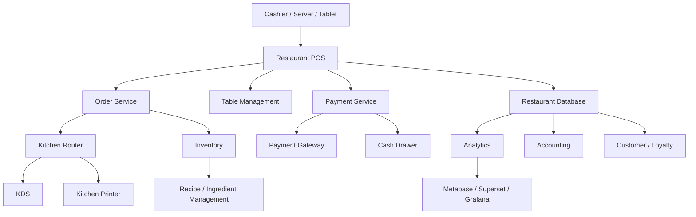
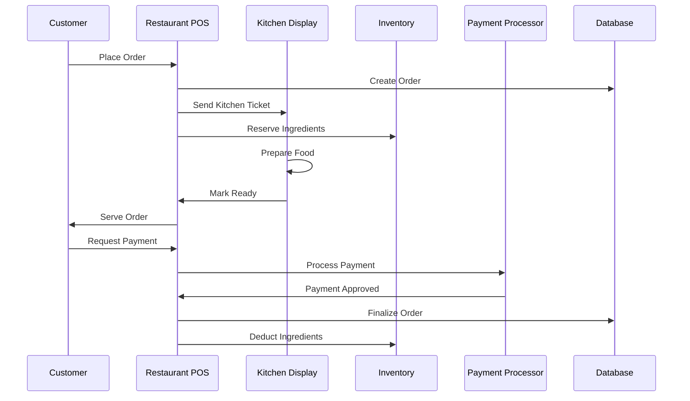
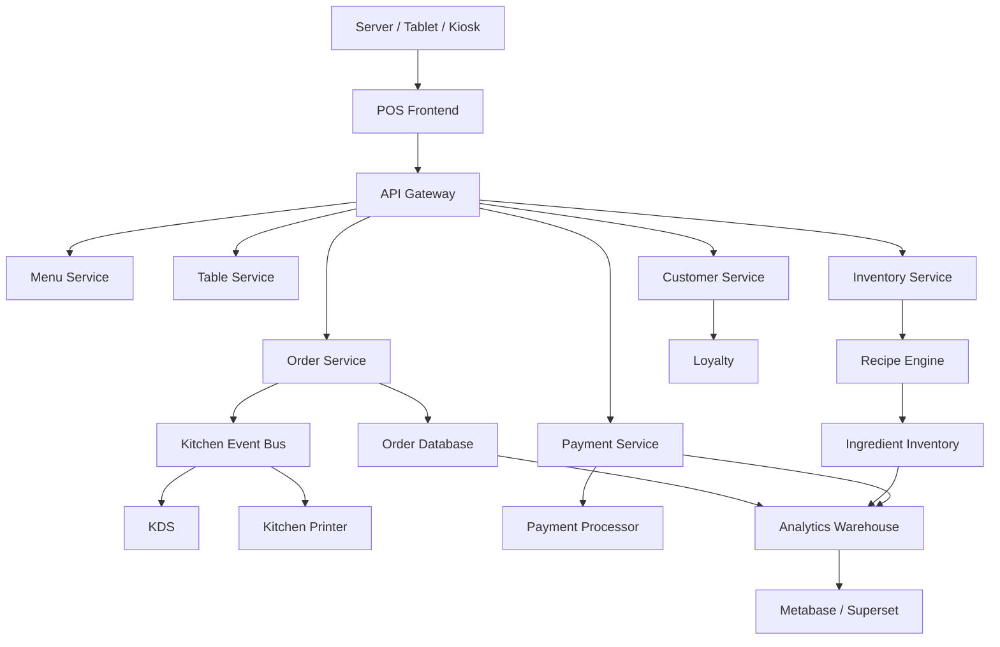
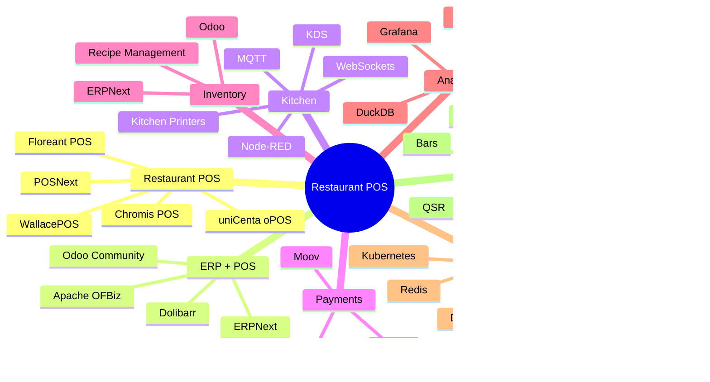

# Awesome-Restaurant-POS

## 🍽️ Top Restaurant POS Ecosystem

**Curated List of SaaS/Hosted Products & Open-Source GitHub Projects**
*Focused on Restaurant Point-of-Sale, Table Management, Kitchen Operations, Payments, Inventory & Hospitality Technology*
**Last updated: September 2026**

This repository tracks notable **SaaS/Hosted restaurant POS platforms** and **open-source POS projects** for restaurants, cafés, bars, QSRs, food trucks, bakeries, hospitality groups, and multi-location food businesses.

**Examples** include Toast, Square for Restaurants, TouchBistro, Lightspeed Restaurant, Clover, Oracle MICROS, Revel Systems, SpotOn Restaurant, CAKE POS, and Epos Now.

A modern restaurant POS is much more than a cash register. It can combine:

* 🍽️ Order taking
* 🪑 Table & floor management
* 💳 Payments
* 👨‍🍳 Kitchen Display Systems (KDS)
* 📦 Inventory
* 🧾 Receipts & taxes
* 👥 Employee management
* 💰 Tips & cash management
* 📱 Online ordering
* 🚚 Delivery
* 🎁 Loyalty
* 📊 Restaurant analytics
* 🧮 Accounting
* 🏪 Multi-location management

**Open-source emphasis:** This repository heavily emphasizes **self-hostable restaurant POS software and reusable open-source building blocks**, including Floreant POS, Chromis POS, uniCenta oPOS, WallacePOS, POSNext, ERPNext, Odoo Community, Open Source Point of Sale, and related hospitality/ERP infrastructure.

> **Important:** An open-source POS can reproduce much of the software functionality of a commercial restaurant POS, but payment processing, PCI compliance, card-network connectivity, fiscalization, hardware certification, and acquiring relationships may still require external services.

---

## Table of Contents

* [SaaS/Hosted Platforms](#saashosted-platforms)
* [Open-Source](#open-source)
* [Open-Source Restaurant POS](#open-source-restaurant-pos)
* [Open-Source General POS](#open-source-general-pos)
* [Open-Source ERP + POS](#open-source-erp--pos)
* [Open-Source Kitchen Display Systems](#open-source-kitchen-display-systems)
* [Open-Source Restaurant Management](#open-source-restaurant-management)
* [Open-Source Inventory & Recipe Management](#open-source-inventory--recipe-management)
* [Open-Source Payments](#open-source-payments)
* [Open-Source Restaurant Analytics](#open-source-restaurant-analytics)
* [Open-Source Building Blocks](#open-source-building-blocks)
* [Commercial Platform → Open-Source Equivalent](#commercial-platform--open-source-equivalent)
* [Restaurant POS Architecture](#restaurant-pos-architecture)
* [Open-Source Restaurant POS Architecture](#open-source-restaurant-pos-architecture)
* [Restaurant Order → Kitchen → Payment Flow](#restaurant-order--kitchen--payment-flow)
* [Commercial vs Open-Source](#commercial-vs-open-source)
* [Recommended Open-Source Stacks](#recommended-open-source-stacks)
* [Restaurant POS Technology Comparison](#restaurant-pos-technology-comparison)
* [Recommended Projects by Use Case](#recommended-projects-by-use-case)
* [Building a Toast Alternative](#building-a-toast-alternative)
* [Building an Open-Source Restaurant POS](#building-an-open-source-restaurant-pos)
* [Open-Source Restaurant POS Landscape](#open-source-restaurant-pos-landscape)
* [Why Open-Source Restaurant POS Matters](#why-open-source-restaurant-pos-matters)
* [How to Contribute](#how-to-contribute)
* [Disclaimer](#disclaimer)

---

# SaaS/Hosted Platforms

| Platform                                                                  | Company         | Primary Focus                    | Key Capabilities                                                 |
| ------------------------------------------------------------------------- | --------------- | -------------------------------- | ---------------------------------------------------------------- |
| **[Toast](https://pos.toasttab.com/)**                                    | Toast           | Restaurant POS ecosystem         | POS, payments, KDS, online ordering, payroll, loyalty, inventory |
| **[Square for Restaurants](https://squareup.com/us/en/restaurants)**      | Block / Square  | SMB restaurant POS               | POS, payments, online ordering, KDS, loyalty, inventory          |
| **[TouchBistro](https://www.touchbistro.com/)**                           | TouchBistro     | Restaurant POS                   | iPad POS, tables, reservations, payments, reporting              |
| **[Lightspeed Restaurant](https://www.lightspeedhq.com/pos/restaurant/)** | Lightspeed      | Restaurant & hospitality POS     | POS, inventory, tables, payments, analytics, multi-location      |
| **[Clover](https://www.clover.com/)**                                     | Fiserv          | POS + payments                   | Restaurant POS, payments, apps, employee management              |
| **[Oracle MICROS](https://www.oracle.com/food-beverage/restaurant-pos/)** | Oracle          | Enterprise hospitality POS       | Enterprise POS, tables, kitchen, payments, inventory, analytics  |
| **[Revel Systems](https://revelsystems.com/)**                            | Revel           | iPad restaurant POS              | POS, inventory, employee management, analytics, multi-location   |
| **[SpotOn Restaurant](https://www.spoton.com/restaurants/)**              | SpotOn          | Restaurant technology            | POS, payments, online ordering, reservations, marketing          |
| **[CAKE POS](https://www.trycake.com/)**                                  | PAR Technology  | Restaurant POS                   | POS, payments, KDS, online ordering, loyalty                     |
| **[Epos Now](https://www.eposnow.com/)**                                  | Epos Now        | Hospitality POS                  | POS, payments, inventory, reporting, integrations                |
| **[NCR Voyix Aloha](https://www.ncrvoyix.com/restaurant/aloha)**          | NCR Voyix       | Enterprise restaurant POS        | POS, payments, KDS, labor, enterprise restaurant management      |
| **[PAR Brink POS](https://partech.com/restaurant/)**                      | PAR Technology  | Enterprise restaurant POS        | QSR POS, drive-thru, payments, digital ordering                  |
| **[GoTab](https://gotab.io/)**                                            | GoTab           | Restaurant commerce              | POS, QR ordering, payments, tableside ordering                   |
| **[Heartland Restaurant](https://www.heartland.us/restaurant)**           | Global Payments | Restaurant POS                   | POS, payments, employee management, reporting                    |
| **[Lavu](https://lavu.com/)**                                             | Lavu            | iPad restaurant POS              | POS, payments, inventory, loyalty, online ordering               |
| **[Rezku](https://rezku.com/)**                                           | Rezku           | Restaurant POS                   | POS, KDS, online ordering, loyalty, reporting                    |
| **[HungerRush](https://www.hungerrush.com/)**                             | HungerRush      | Restaurant technology            | POS, online ordering, delivery, marketing                        |
| **[Restaurant365 POS](https://www.restaurant365.com/)**                   | Restaurant365   | Restaurant operations            | POS, accounting, inventory, labor, analytics                     |
| **[Crunchtime](https://www.crunchtime.com/)**                             | Crunchtime      | Enterprise restaurant operations | Operations, inventory, labor, food safety, analytics             |

Current restaurant-POS comparisons continue to place Toast, Square, Lightspeed, TouchBistro, Clover, SpotOn and enterprise platforms such as Oracle MICROS among the major restaurant POS systems.

---

# Open-Source

The open-source restaurant POS ecosystem is smaller than the commercial ecosystem, but there are several useful projects.

```text
                    OPEN-SOURCE RESTAURANT POS
                               │
          ┌────────────────────┼────────────────────┐
          │                    │                    │
          ▼                    ▼                    ▼
    Restaurant POS          General POS          ERP + POS
          │                    │                    │
          ▼                    ▼                    ▼
     Floreant POS         uniCenta oPOS         ERPNext
     Chromis POS           OSPOS                  Odoo
     WallacePOS            WallacePOS             Dolibarr
          │
          ▼
    Restaurant-specific
    tables + kitchen +
    orders + modifiers
```

---

# Open-Source Restaurant POS

## ⭐ Floreant POS

**[Floreant POS](https://github.com/floreantpos/floreantpos)** is one of the most directly relevant open-source alternatives to commercial restaurant POS systems.

It is specifically designed for restaurants and supports features such as:

* Dine-in
* Table management
* Guest/seat management
* Split checks
* Tips
* Takeout
* Delivery
* Kitchen printing
* Kitchen Display System
* Modifiers
* Discounts
* Cash drawer
* Touchscreen operation
* Offline operation
* Reporting
* Multiple terminals

The project describes itself as a free, open-source restaurant POS and supports Windows, macOS and Linux.

Floreant POS is released under **MRPL 1.2**; verify the current license and redistribution requirements before deployment.

---

## ⭐ Chromis POS

**[Chromis POS](https://github.com/ChromisPos/ChromisPOS)** is an open-source POS derived from the Openbravo POS lineage.

It provides:

* Touch POS
* Product management
* Sales
* Restaurant functionality
* Table management
* Kitchen tickets
* Inventory
* Customer management
* Employee management
* Reporting
* Payment integrations

Chromis documents itself as free/open-source software under the GPL family of licenses.

---

## ⭐ uniCenta oPOS

**[uniCenta oPOS](https://github.com/uniCenta/uniCentaPOS)** is a long-running open-source POS platform with applicability to retail and hospitality.

Useful capabilities include:

* Touchscreen POS
* Product management
* Inventory
* Customers
* Employees
* Reporting
* Restaurant tables
* Kitchen tickets
* Multiple payment methods

There are also active/community forks of the project.

---

## ⭐ WallacePOS

**[WallacePOS](https://github.com/micwallace/wallacepos)** is a web-based open-source POS system.

It includes:

* Web-based POS
* Product management
* Sales
* Reporting
* Hardware integration
* Multi-terminal operation
* Restaurant/café order workflows

The original repository states that WallacePOS is **no longer actively maintained**, so it is better treated as a reference codebase or starting point rather than a first-choice production system.

Its restaurant functionality includes a dedicated order workflow suitable for cafés and restaurants.

---

# Open-Source General POS

These projects are not exclusively restaurant-focused, but can be adapted to restaurants.

| Project                                                                                       | Description                     | Restaurant Suitability |
| --------------------------------------------------------------------------------------------- | ------------------------------- | ---------------------- |
| **[Open Source Point of Sale](https://github.com/opensourcepos/opensourcepos)**               | Web-based inventory and POS     | ⭐⭐⭐                    |
| **[Loyverse alternatives / community POS projects](https://github.com/topics/point-of-sale)** | Community POS implementations   | ⭐⭐                     |
| **[POSNext](https://github.com/DeeloaSociety/posnext)**                                       | Modern POS built around ERPNext | ⭐⭐⭐⭐                   |
| **[Lakasir](https://github.com/lakasir/lakasir)**                                             | Open-source POS                 | ⭐⭐⭐                    |
| **[WallacePOS](https://github.com/micwallace/wallacepos)**                                    | Web POS                         | ⭐⭐⭐                    |
| **[uniCenta oPOS](https://github.com/uniCenta/uniCentaPOS)**                                  | Retail/hospitality POS          | ⭐⭐⭐⭐                   |
| **[Chromis POS](https://github.com/ChromisPos/ChromisPOS)**                                   | Open-source POS                 | ⭐⭐⭐⭐                   |

---

# Open-Source ERP + POS

ERP platforms can provide significantly more functionality around the POS itself.

| Project                                                       | POS | Inventory | Accounting | Restaurant | Open Source |
| ------------------------------------------------------------- | :-: | :-------: | :--------: | :--------: | :---------: |
| **[ERPNext](https://github.com/frappe/erpnext)**              |  ✅  |     ✅     |      ✅     |     ⚠️     |      ✅      |
| **[Odoo Community](https://github.com/odoo/odoo)**            |  ✅  |     ✅     |      ✅     |     ⚠️     |      ✅      |
| **[Dolibarr](https://github.com/Dolibarr/dolibarr)**          |  ✅  |     ✅     |      ✅     |     ⚠️     |      ✅      |
| **[Apache OFBiz](https://github.com/apache/ofbiz-framework)** |  ⚠️ |     ✅     |      ✅     |     ⚠️     |      ✅      |
| **[Tryton](https://www.tryton.org/)**                         |  ⚠️ |     ✅     |      ✅     |     ⚠️     |      ✅      |

These systems become attractive when the restaurant requires more than POS functionality:

```text
POS
 +
Inventory
 +
Purchasing
 +
Accounting
 +
CRM
 +
Employees
 +
Warehousing
 =
Restaurant ERP
```

---

# Open-Source Kitchen Display Systems

A KDS is the restaurant equivalent of a production workflow system.

```text
                     ORDER
                       │
                       ▼
                  Restaurant POS
                       │
                       ▼
                  Order Router
                       │
          ┌────────────┼────────────┐
          ▼            ▼            ▼
       Kitchen 1    Kitchen 2     Bar
          │            │            │
          ▼            ▼            ▼
         KDS          KDS          KDS
          │
          ▼
       Prepared
          │
          ▼
       Completed
```

Possible open-source building blocks include:

| Project                                                        | Role                              |
| -------------------------------------------------------------- | --------------------------------- |
| **[Floreant POS](https://github.com/floreantpos/floreantpos)** | Restaurant POS + kitchen workflow |
| **[Chromis POS](https://github.com/ChromisPos/ChromisPOS)**    | POS + kitchen tickets             |
| **[uniCenta oPOS](https://github.com/uniCenta/uniCentaPOS)**   | POS + restaurant workflows        |
| **[ERPNext](https://github.com/frappe/erpnext)**               | POS + inventory/workflow          |
| **[Odoo Community](https://github.com/odoo/odoo)**             | POS + operations                  |
| **[Node-RED](https://github.com/node-red/node-red)**           | Custom event/order workflows      |
| **[MQTT](https://github.com/eclipse-mosquitto/mosquitto)**     | Device/event messaging            |
| **[Home Assistant](https://github.com/home-assistant/core)**   | IoT/device orchestration          |

A custom KDS can be built using:

```text
React / Vue
     +
WebSockets
     +
Node.js / FastAPI
     +
PostgreSQL
     +
MQTT
     +
Kitchen Display
```

---

# Open-Source Restaurant Management

Restaurant POS is only one part of restaurant operations.

```text
                    RESTAURANT
                        │
        ┌───────────────┼────────────────┐
        │               │                │
        ▼               ▼                ▼
       POS           Inventory          Labor
        │               │                │
        ▼               ▼                ▼
     Payments        Purchasing        Scheduling
        │               │                │
        └───────────────┼────────────────┘
                        ▼
                    Accounting
```

Useful open-source platforms include:

* **[ERPNext](https://github.com/frappe/erpnext)**
* **[Odoo Community](https://github.com/odoo/odoo)**
* **[Dolibarr](https://github.com/Dolibarr/dolibarr)**
* **[Apache OFBiz](https://github.com/apache/ofbiz-framework)**
* **[Tryton](https://www.tryton.org/)**
* **[Frappe Framework](https://github.com/frappe/frappe)**

---

# Open-Source Inventory & Recipe Management

Restaurant inventory is more specialized than ordinary retail inventory.

A restaurant often needs:

```text
Ingredient
    │
    ▼
Recipe
    │
    ▼
Menu Item
    │
    ▼
Sale
    │
    ▼
Ingredient Consumption
    │
    ▼
Inventory
    │
    ▼
Food Cost
```

Useful platforms:

| Project              |   Inventory  |    Recipes   |  Purchasing  |  Accounting |
| -------------------- | :----------: | :----------: | :----------: | :---------: |
| **ERPNext**          |       ✅      |       ✅      |       ✅      |      ✅      |
| **Odoo Community**   |       ✅      |       ✅      |       ✅      |      ✅      |
| **Dolibarr**         |       ✅      |      ⚠️      |       ✅      |      ✅      |
| **Floreant POS**     |       ✅      |       ✅      |      ⚠️      |      ⚠️     |
| **uniCenta oPOS**    |       ✅      |      ⚠️      |       ✅      |      ⚠️     |
| **Frappe Framework** | Customizable | Customizable | Customizable | Via ERPNext |

---

# Open-Source Payments

Restaurant POS systems frequently need to integrate with:

* Card terminals
* Cash drawers
* Receipt printers
* Payment gateways
* QR payments
* Digital wallets
* ACH/bank payments
* Refund systems

Useful open-source payment infrastructure includes:

| Project                                                  | Role                                  |
| -------------------------------------------------------- | ------------------------------------- |
| **[Hyperswitch](https://github.com/juspay/hyperswitch)** | Payment orchestration                 |
| **[Moov](https://github.com/moov-io)**                   | Financial/payment infrastructure      |
| **[Kill Bill](https://github.com/killbill/killbill)**    | Billing/payment infrastructure        |
| **[Stripe Terminal SDKs](https://github.com/stripe)**    | Integration reference / SDK ecosystem |
| **[jPOS](https://github.com/jpos/jPOS)**                 | ISO 8583 transaction processing       |
| **[Medusa](https://github.com/medusajs/medusa)**         | Commerce infrastructure               |

> Payment processing is an area where an open-source POS normally still depends on external payment processors, acquirers and certified hardware.

---

# Open-Source Restaurant Analytics

A modern restaurant POS generates large volumes of operational data.

```text
POS
 │
 ├── Sales
 ├── Products
 ├── Tables
 ├── Employees
 ├── Payments
 ├── Discounts
 ├── Tips
 ├── Inventory
 └── Kitchen Times
          │
          ▼
       Data Warehouse
          │
          ▼
       Analytics
          │
     ┌────┼────┐
     ▼    ▼    ▼
   Sales Labor Food Cost
     │    │    │
     └────┼────┘
          ▼
       Dashboard
```

Useful open-source analytics infrastructure:

| Project                                                    | Role                   |
| ---------------------------------------------------------- | ---------------------- |
| **[Apache Superset](https://github.com/apache/superset)**  | BI dashboards          |
| **[Metabase](https://github.com/metabase/metabase)**       | Business intelligence  |
| **[Grafana](https://github.com/grafana/grafana)**          | Operational dashboards |
| **[Apache ECharts](https://github.com/apache/echarts)**    | Visualization          |
| **[ClickHouse](https://github.com/ClickHouse/ClickHouse)** | Analytics database     |
| **[PostgreSQL](https://www.postgresql.org/)**              | Operational database   |
| **[DuckDB](https://github.com/duckdb/duckdb)**             | Local analytics        |
| **[dbt Core](https://github.com/dbt-labs/dbt-core)**       | Analytics engineering  |

---

# Open-Source Building Blocks

A modern self-hosted restaurant POS can be assembled from general-purpose open-source infrastructure.

| Layer          | Projects                     |
| -------------- | ---------------------------- |
| Frontend       | React, Vue, Svelte           |
| Mobile         | React Native, Flutter        |
| Backend        | Node.js, FastAPI, Django, Go |
| Database       | PostgreSQL, MariaDB          |
| Cache          | Redis, Valkey                |
| Messaging      | Kafka, NATS, RabbitMQ        |
| Realtime       | WebSockets, Socket.IO        |
| IoT            | MQTT, Mosquitto              |
| Workflow       | Temporal, Camunda            |
| Authentication | Keycloak                     |
| API Gateway    | Kong, Traefik                |
| Analytics      | Superset, Metabase, Grafana  |
| Data Warehouse | ClickHouse, DuckDB           |
| Object Storage | MinIO                        |
| Monitoring     | Prometheus, Grafana          |
| Deployment     | Docker, Kubernetes           |

---

# Commercial Platform → Open-Source Equivalent

| Commercial Restaurant POS     | Open-Source Equivalent / Building Blocks            |
| ----------------------------- | --------------------------------------------------- |
| **Toast**                     | Floreant POS + ERPNext + Hyperswitch + custom KDS   |
| **Square for Restaurants**    | Floreant / uniCenta + ERPNext + payment gateway     |
| **TouchBistro**               | Floreant + custom tablet UI + PostgreSQL            |
| **Lightspeed Restaurant**     | ERPNext + Floreant + analytics stack                |
| **Clover**                    | uniCenta + payment processor + ERPNext              |
| **Oracle MICROS**             | Floreant + ERPNext + custom enterprise integrations |
| **Revel Systems**             | Floreant + React + PostgreSQL + KDS                 |
| **SpotOn Restaurant**         | Floreant + ERPNext + online ordering + CRM          |
| **CAKE POS**                  | Floreant + custom KDS + payment infrastructure      |
| **Epos Now**                  | uniCenta + ERPNext + inventory                      |
| **NCR Aloha**                 | Floreant + KDS + enterprise workflow + analytics    |
| **PAR Brink**                 | Floreant + custom QSR workflows + KDS               |
| **Restaurant365 POS**         | ERPNext + POS + accounting + analytics              |
| **Enterprise Restaurant POS** | ERPNext + Floreant + PostgreSQL + Kafka + BI        |

---

# Restaurant POS Architecture

A commercial-grade restaurant POS can be viewed as several interconnected systems:

```text
                         RESTAURANT POS
                              │
       ┌──────────────────────┼──────────────────────┐
       │                      │                      │
       ▼                      ▼                      ▼
     Orders                 Tables                Payments
       │                      │                      │
       ▼                      ▼                      ▼
     Kitchen              Floor Plan             Processor
       │                                             │
       ▼                                             ▼
      KDS                                          Settlement
       │
       └──────────────────────┐
                              ▼
                         POS Database
                              │
          ┌───────────────────┼───────────────────┐
          ▼                   ▼                   ▼
       Inventory            Labor             Analytics
          │                   │                   │
          └───────────────────┼───────────────────┘
                              ▼
                         Accounting
```

---

# Open-Source Restaurant POS Architecture



---

# Restaurant Order → Kitchen → Payment Flow



---

# Multi-Location Restaurant Architecture

```text
                         CORPORATE
                            │
                     Central Database
                            │
          ┌─────────────────┼─────────────────┐
          │                 │                 │
          ▼                 ▼                 ▼
       Location 1        Location 2        Location 3
          │                 │                 │
       ┌──┴──┐           ┌──┴──┐           ┌──┴──┐
       ▼     ▼           ▼     ▼           ▼     ▼
      POS   KDS          POS   KDS          POS   KDS
       │     │            │     │            │     │
       └─────┘            └─────┘            └─────┘
          │                 │                 │
          └─────────────────┼─────────────────┘
                            ▼
                       Central BI
```

For unreliable connectivity, an **offline-first architecture** is especially important.

```text
              Cloud
                │
                │ Sync
                ▼
        ┌────────────────┐
        │ Local POS Node  │
        └───────┬────────┘
                │
        ┌───────┼────────┐
        ▼       ▼        ▼
       POS     KDS     Printer
        │
     Local DB
        │
        ▼
   Offline Operation
```

Floreant is specifically positioned as a non-cloud/offline restaurant POS, making this architecture particularly relevant to self-hosted restaurant deployments.

---

# Commercial vs Open-Source

| Capability             | Commercial POS   | Open-Source POS                |
| ---------------------- | ---------------- | ------------------------------ |
| Restaurant POS         | ✅                | ✅                              |
| Table Management       | ✅                | ✅                              |
| Order Management       | ✅                | ✅                              |
| Kitchen Display        | ✅                | ✅ / Build                      |
| Inventory              | ✅                | ✅                              |
| Recipe Management      | ✅                | ✅ / Build                      |
| Payments               | ✅                | ⚠️ Integration required        |
| Card Processing        | ✅                | External processor             |
| Hardware Certification | ✅                | Must manage                    |
| Offline Mode           | Usually          | ✅ Possible                     |
| Online Ordering        | Usually          | Build / Integrate              |
| Delivery               | Usually          | Build / Integrate              |
| Loyalty                | Usually          | Build / Integrate              |
| CRM                    | Usually          | Build / Integrate              |
| Analytics              | ✅                | Build / Integrate              |
| Accounting             | Usually          | ERP integration                |
| Multi-location         | ✅                | Possible                       |
| Source Code            | ❌                | ✅                              |
| Customization          | Limited          | Very High                      |
| Self Hosting           | Usually ❌        | ✅                              |
| Data Ownership         | Vendor-dependent | Full control                   |
| Vendor Lock-in         | Higher           | Lower                          |
| Hardware Ecosystem     | Mature           | More integration work          |
| Support                | Managed          | Community / Commercial Support |
| Initial Setup          | Easier           | Harder                         |
| Long-term Control      | Lower            | Higher                         |

---

# Restaurant POS Technology Comparison

| Project            | Restaurant-Focused | Tables | KDS | Inventory | Offline | Multi-Location | Self-Host |
| ------------------ | :----------------: | :----: | :-: | :-------: | :-----: | :------------: | :-------: |
| **Floreant POS**   |          ✅         |    ✅   |  ✅  |     ✅     |    ✅    |       ⚠️       |     ✅     |
| **Chromis POS**    |          ✅         |    ✅   |  ✅  |     ✅     |    ✅    |       ⚠️       |     ✅     |
| **uniCenta oPOS**  |         ⚠️         |    ✅   |  ✅  |     ✅     |    ✅    |       ⚠️       |     ✅     |
| **WallacePOS**     |         ⚠️         |   ⚠️   |  ⚠️ |     ✅     |    ⚠️   |        ✅       |     ✅     |
| **POSNext**        |         ⚠️         |   ⚠️   |  ⚠️ |     ✅     |    ⚠️   |        ✅       |     ✅     |
| **ERPNext**        |         ⚠️         |   ⚠️   |  ⚠️ |     ✅     |    ⚠️   |        ✅       |     ✅     |
| **Odoo Community** |         ⚠️         |   ⚠️   |  ⚠️ |     ✅     |    ⚠️   |        ✅       |     ✅     |
| **Dolibarr**       |         ⚠️         |   ⚠️   |  ⚠️ |     ✅     |    ⚠️   |        ✅       |     ✅     |

---

# Recommended Open-Source Stacks

## 1. 🏆 Best Direct Restaurant POS

```text
Floreant POS
     +
PostgreSQL / Embedded Database
     +
Custom Payment Integration
     +
KDS
```

Best for:

* Independent restaurants
* Cafés
* Small chains
* Offline-first deployments
* Developers wanting a restaurant-native starting point

---

## 2. 🏢 Restaurant ERP

```text
ERPNext
   +
POS
   +
Inventory
   +
Accounting
   +
Purchasing
   +
Analytics
```

Best for restaurants wanting their POS integrated with broader business operations.

---

## 3. ⚡ Modern Custom Restaurant POS

```text
React
 +
FastAPI
 +
PostgreSQL
 +
Redis
 +
WebSockets
 +
MQTT
 +
Floreant-inspired workflows
```

Best for developers building a new cloud-native restaurant platform.

---

## 4. 🍳 Custom KDS

```text
Restaurant POS
      │
      ▼
Order Event Bus
      │
      ▼
Kafka / NATS / MQTT
      │
 ┌────┼────┐
 ▼    ▼    ▼
Hot  Cold  Bar
KDS  KDS   KDS
```

---

## 5. 📊 Restaurant Analytics Stack

```text
POS
 │
 ▼
PostgreSQL
 │
 ▼
ClickHouse
 │
 ▼
dbt
 │
 ▼
Superset / Metabase
 │
 ▼
Restaurant Dashboard
```

Useful metrics:

* Sales per hour
* Average order value
* Covers
* Table turnover
* Food cost
* Labor cost
* Gross margin
* Item popularity
* Modifier popularity
* Void rate
* Discount rate
* Payment mix
* Kitchen preparation time
* Order-to-ready time
* Revenue per location

---

# Recommended Projects by Use Case

| Use Case                        | Recommended Starting Point          |
| ------------------------------- | ----------------------------------- |
| Best open-source restaurant POS | **Floreant POS**                    |
| Offline restaurant POS          | **Floreant POS**                    |
| Restaurant table management     | **Floreant / Chromis / uniCenta**   |
| Kitchen workflows               | **Floreant / Chromis**              |
| General-purpose POS             | **uniCenta / OSPOS**                |
| Web-based POS                   | **WallacePOS / OSPOS**              |
| POS + ERP                       | **ERPNext**                         |
| POS + Accounting                | **ERPNext / Odoo**                  |
| POS + Inventory                 | **ERPNext / Odoo / uniCenta**       |
| Restaurant customization        | **Floreant POS**                    |
| Modern custom POS               | **POSNext / Frappe / custom React** |
| Enterprise ERP integration      | **ERPNext / Odoo / Apache OFBiz**   |
| Payment orchestration           | **Hyperswitch**                     |
| Payment infrastructure          | **Moov**                            |
| Restaurant BI                   | **Superset / Metabase**             |
| Real-time KDS                   | **WebSockets + MQTT**               |
| IoT / hardware integration      | **MQTT + Node-RED**                 |
| Multi-location analytics        | **ClickHouse + Superset**           |

---

# Building a Toast Alternative

A Toast-like restaurant technology platform can be decomposed into several independent systems:

```text
                              TOAST-LIKE PLATFORM
                                      │
             ┌────────────────────────┼────────────────────────┐
             │                        │                        │
             ▼                        ▼                        ▼
           POS                    Payments                   KDS
             │                        │                        │
             ▼                        ▼                        ▼
        Order Engine             Payment API             Kitchen Router
             │                        │                        │
             └────────────────────────┼────────────────────────┘
                                      ▼
                              Restaurant Database
                                      │
                 ┌────────────────────┼────────────────────┐
                 │                    │                    │
                 ▼                    ▼                    ▼
             Inventory              Labor               Analytics
                 │                    │                    │
                 └────────────────────┼────────────────────┘
                                      ▼
                                  Accounting
```

Possible open-source implementation:

```text
POS                  → Floreant / Custom React POS
Backend              → FastAPI / Node.js
Database             → PostgreSQL
Cache                → Redis / Valkey
Messaging            → Kafka / NATS
KDS                  → React + WebSockets
Payments             → Hyperswitch / Processor APIs
Inventory            → ERPNext
Accounting           → ERPNext
Analytics            → ClickHouse + Superset
Authentication       → Keycloak
Object Storage       → MinIO
Monitoring           → Prometheus + Grafana
Deployment            → Docker / Kubernetes
```

---

# Building an Open-Source Restaurant POS

A modern architecture could be:



---

# Restaurant POS Data Model

A robust restaurant POS generally revolves around:

```text
Restaurant
   │
   ├── Location
   │     │
   │     ├── Tables
   │     ├── Terminals
   │     ├── Printers
   │     └── KDS
   │
   ├── Menu
   │     ├── Categories
   │     ├── Items
   │     ├── Modifiers
   │     └── Combos
   │
   ├── Orders
   │     ├── Items
   │     ├── Discounts
   │     ├── Taxes
   │     └── Tips
   │
   ├── Payments
   │
   ├── Customers
   │
   ├── Employees
   │
   └── Inventory
         ├── Ingredients
         ├── Recipes
         ├── Suppliers
         └── Purchase Orders
```

---

# Restaurant POS Event Architecture

An event-driven architecture is useful for synchronizing POS, KDS, inventory and analytics.

```text
                     ORDER CREATED
                           │
                           ▼
                       Event Bus
                           │
         ┌─────────────────┼─────────────────┐
         ▼                 ▼                 ▼
        KDS             Inventory         Analytics
         │                 │                 │
         ▼                 ▼                 ▼
     Prepare Food      Deduct Stock       Record Sale
         │
         ▼
    ORDER READY
         │
         ▼
      POS / Server
         │
         ▼
      PAYMENT
         │
         ▼
     ACCOUNTING
```

Possible infrastructure:

```text
Kafka / NATS
     +
PostgreSQL
     +
Redis
     +
WebSockets
     +
MQTT
```

---

# Offline-First Restaurant POS

Restaurant POS systems have a unique reliability requirement:

> **A restaurant must be able to continue taking orders even when the Internet goes down.**

A robust architecture therefore looks like:

```text
                    CLOUD
                      │
                 Sync Service
                      │
                      ▼
              ┌───────────────┐
              │ Local POS Node│
              └───────┬───────┘
                      │
        ┌─────────────┼─────────────┐
        ▼             ▼             ▼
      Server         KDS         Payment
        │
     Local DB
        │
        ▼
    Offline Queue
        │
        ▼
    Later Sync
```

Important design principles:

* Local database
* Local order queue
* Idempotent synchronization
* Conflict resolution
* Local menu cache
* Local printer control
* Local KDS
* Graceful payment degradation
* Cloud synchronization
* Audit logs

---

# Open-Source Restaurant POS Landscape



---

# Why Open-Source Restaurant POS Matters

Commercial restaurant POS platforms are increasingly becoming the **operating system of restaurants**.

They combine:

```text
POS
+
Payments
+
Online Ordering
+
Delivery
+
Inventory
+
Labor
+
Marketing
+
Loyalty
+
Analytics
```

Open-source allows restaurants and developers to own more of that technology stack.

### Key advantages

* 🔓 Source-code access
* 🛠️ Deep customization
* 🏠 Self-hosting
* 🔐 Data ownership
* 🌐 Offline operation
* 🔌 Custom hardware integration
* 💳 Processor flexibility
* 📊 Custom analytics
* 🧩 ERP integration
* 🚫 Reduced vendor lock-in
* 🌍 Localization
* 🧾 Custom tax/fiscal workflows

The strongest approach is often **not** attempting to reproduce every feature of Toast or Oracle MICROS inside one project.

Instead, compose specialized open-source components:

```text
                 OPEN-SOURCE RESTAURANT STACK

                    ┌──────────────┐
                    │ Floreant POS │
                    └──────┬───────┘
                           │
          ┌────────────────┼────────────────┐
          ▼                ▼                ▼
      ERPNext          Hyperswitch       Custom KDS
          │                │                │
          ▼                ▼                ▼
     Inventory         Payments          Kitchen
          │                │                │
          └────────────────┼────────────────┘
                           ▼
                    PostgreSQL
                           │
                           ▼
                 ClickHouse / DuckDB
                           │
                           ▼
                 Superset / Metabase
```

---

# ⭐ Best Open-Source Restaurant POS Projects

| Rank | Project                                                                         | Best For                            |
| ---: | ------------------------------------------------------------------------------- | ----------------------------------- |
|    1 | **[Floreant POS](https://github.com/floreantpos/floreantpos)**                  | Direct restaurant POS replacement   |
|    2 | **[Chromis POS](https://github.com/ChromisPos/ChromisPOS)**                     | Restaurant/retail POS customization |
|    3 | **[uniCenta oPOS](https://github.com/uniCenta/uniCentaPOS)**                    | General POS + restaurant workflows  |
|    4 | **[ERPNext](https://github.com/frappe/erpnext)**                                | POS + ERP + accounting + inventory  |
|    5 | **[Odoo Community](https://github.com/odoo/odoo)**                              | POS + broader business operations   |
|    6 | **[POSNext](https://github.com/DeeloaSociety/posnext)**                         | Modern ERPNext POS development      |
|    7 | **[Open Source Point of Sale](https://github.com/opensourcepos/opensourcepos)** | General-purpose web POS             |
|    8 | **[WallacePOS](https://github.com/micwallace/wallacepos)**                      | Web-based POS reference             |
|    9 | **[Dolibarr](https://github.com/Dolibarr/dolibarr)**                            | ERP + POS                           |
|   10 | **[Apache OFBiz](https://github.com/apache/ofbiz-framework)**                   | Enterprise commerce/ERP foundation  |

Floreant is currently one of the clearest open-source projects to evaluate first when the requirement is specifically a **restaurant-native POS**, rather than a generic retail POS.

---

# How to Contribute

1. Fork the repository.
2. Add or edit entries in `README.md`.
3. Include:

   * Project name
   * Official website
   * GitHub repository where available
   * 1–2 sentence factual description
   * Restaurant/POS relevance
   * License where known
4. Clearly distinguish **SaaS/Hosted**, **Open Source**, **Open Core**, and **Source Available** projects.
5. Submit a PR with a short explanation.

Please prioritize:

* Active projects
* Restaurant-specific POS software
* Open-source licenses
* Self-hostable systems
* Kitchen systems
* Payment integrations
* Inventory/recipe systems
* Restaurant analytics
* POS hardware integrations

Star the repository if you find it useful! ⭐

---

# Disclaimer

* This is a **community-curated ecosystem list**, not an endorsement of any vendor or project.
* Commercial POS products, pricing, payment rates, hardware compatibility and features can change over time.
* Open-source projects may differ significantly in maintenance activity, production readiness and available support.
* **Open source does not automatically mean payment-processing or regulatory compliance.**
* Restaurants deploying payment functionality must consider **PCI DSS**, payment-terminal certification, local tax/fiscalization requirements, acquiring-bank requirements and applicable regulations.
* Some projects listed here are general POS or ERP systems rather than restaurant-specific software.
* Always verify the current license before modifying, redistributing or commercially deploying software.
* WallacePOS, for example, explicitly states that its original repository is no longer actively maintained, so it should be evaluated accordingly.
* Floreant POS is open source under **MRPL 1.2**, while its commercial ORO POS offering is separate; verify the current licensing and support terms for your intended deployment.

---

**Made for restaurant owners, developers, hospitality technology teams, POS integrators, and open-source enthusiasts.**

Let's make restaurant technology more **open, customizable, interoperable, and developer-friendly.**

**Last updated: September 2026**

